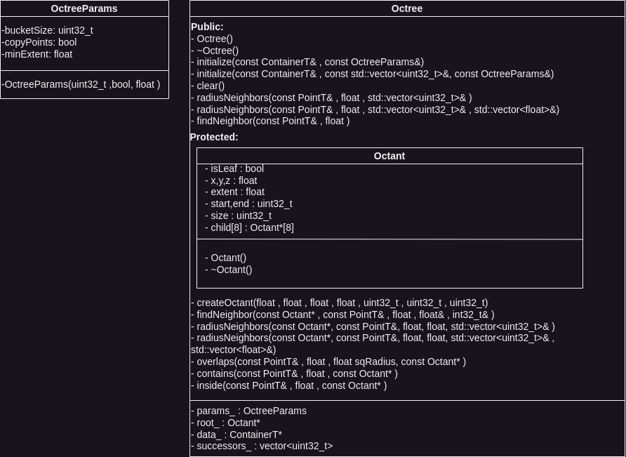

# Proyecto - Estructura de Datos Avanzados

Replica del proyecto: Efficient Radius Neighbor Search in Three-dimensional Point Clouds

Link proyecto original: [Pagina original](https://github.com/jbehley/octree)


## Construccion

El octree en sí mismo no tiene dependencias.
Sin embargo, para compilar los ejemplos, necesitas [CMake](http://www.cmake.org/) y la [biblioteca Boost C++](http://www.boost.org/).
Para construir los ejemplos, primero debes construir el proyecto:

```bash
mkdir build
cd build
cmake ..
make
```

Para ejecutar los ejemplos, necesitas algunos datos de nube de puntos:

```bash
wget http://jbehley.github.io/data/wachtberg_folds.zip
unzip wachtberg_folds.zip -d data
```

Ahora puedes ejecutar los ejemplos:

```bash
./example1 data/scan_001_points.dat
```

que realiza algunas consultas y demuestra la flexibilidad de nuestra implementación de Octree para manejar diferentes implementaciones de puntos.

Los diferentes ejemplos muestran algunos casos de uso del octree. `example1` demuestra el uso general con tipos de datos de puntos que proporcionan acceso público a las coordenadas x, y, z. `example2` muestra cómo utilizar un tipo de punto diferente, que tiene coordenadas no públicas. `example3` muestra cómo utilizar el método de plantilla dentro de un descriptor también templado.

También proporcionamos un caso de prueba utilizando el [Google Test Framework (GTest)](https://code.google.com/p/googletest/), que se compila automáticamente si el paquete se encuentra ya sea por CMake o en el directorio fuente correspondiente, por ejemplo, /usr/src/gtest/.
Puedes invocar la suite de pruebas con:

```bash
./octree-test
```

## Analisis:

Las siguientes clases estan presentes en el proyecto:




## Codigo

```cpp
// necesario para obtener acceso de prueba a miembros protegidos/privados...
namespace
{
    class OctreeTest;
}

namespace unibn
{
    /*
      Algunos rasgos para acceder a coordenadas independientemente de la implementación
      específica de punto inspirada en boost.geometry, que necesita ser implementada por nuevos puntos.
    */

    namespace traits {

        // Plantilla de estructura para los rasgos de acceso a coordenadas
        template <typename PointT, int D>
        struct access {};

        // Especialización para la dimensión 0 (x)
        template <class PointT>
        struct access<PointT, 0> {
            // Función estática que devuelve la coordenada x del punto
            static float get(const PointT& p) {
                return p.x;
            }
        };

        // Especialización para la dimensión 1 (y)
        template <class PointT>
        struct access<PointT, 1> {
            // Función estática que devuelve la coordenada y del punto
            static float get(const PointT& p) {
                return p.y;
            }
        };

        // Especialización para la dimensión 2 (z)
        template <class PointT>
        struct access<PointT, 2> {
            // Función estática que devuelve la coordenada z del punto
            static float get(const PointT& p) {
                return p.z;
            }
        };
    }

    /**
      Función de conveniencia para acceder a las coordenadas de un punto en un espacio multidimensional.
    **/
    template <int D, typename PointT>
    inline float get(const PointT& p)
    {
        // Utiliza la estructura de rasgos 'access' para obtener la coordenada correspondiente
        return traits::access<PointT, D>::get(p);
    }
}
```

Este código es parte de una implementación del octree (árbol octal) y esta enfocado en proporcionar acceso a las coordenadas de puntos en un espacio tridimensional (o más dimensional) de manera genérica.

A continuación, una breve explicación de las partes clave del código:

1. **Namespace `unibn`:**
   - Contiene la implementación del octree y los rasgos para acceder a coordenadas.

2. **Namespace `traits`:**
   - Define un conjunto de rasgos para acceder a coordenadas de puntos en un espacio multidimensional. Estos rasgos se especializan para las dimensiones x, y, y z.

3. **Clase de rasgos (`access`):**
   - Plantilla de estructura que proporciona una interfaz para acceder a coordenadas en una dimensión específica.
   - Se especializa para las dimensiones x, y y z, cada una con una función estática `get` que devuelve la coordenada correspondiente.

4. **Función de conveniencia (`get`):**
   - Ofrece una interfaz sencilla para acceder a las coordenadas de un punto en un espacio multidimensional.
   - Utiliza la estructura de rasgos `access` para obtener la coordenada correspondiente a la dimensión especificada.

Este código modulariza el acceso a las coordenadas de un punto en un espacio multidimensional. La implementación del octree probablemente utilizará estas funciones para acceder a las coordenadas de los puntos almacenados en el árbol. Además, la encapsulación en namespaces y clases permitirá una extensión y prueba más sencilla del código.


Algunas distancias genéricas: Manhattan, Euclídea (al cuadrado) y Distancia máxima.
Una Distancia tiene que implementar los métodos
1. compute de dos puntos p y q para calcular y devolver la distancia entre dos puntos, y
2. norma de coordenadas x, y, z para calcular y devolver la norma de un punto p = (x, y, z)
3. sqr y sqrt of value para calcular el radio correcto si se realiza una comparación utilizando normas al cuadrado

### 1. L1Distance


Método para calcular la distancia de Manhattan entre dos puntos p y q:

```cpp
template <typename PointT>
struct L1Distance
{
  // Método para calcular la distancia de Manhattan entre dos puntos p y q
  static inline float compute(const PointT& p, const PointT& q)  {
    float diff1 = get<0>(p) - get<0>(q);
    float diff2 = get<1>(p) - get<1>(q);
    float diff3 = get<2>(p) - get<2>(q);

    // La distancia de Manhattan es la suma de las diferencias absolutas en cada dimensión
    return std::abs(diff1) + std::abs(diff2) + std::abs(diff3);
  }

  // Método para calcular la norma de un punto en coordenadas x, y, z
  static inline float norm(float x, float y, float z)  {
    // La norma L1 es la suma de los valores absolutos de las coordenadas
    return std::abs(x) + std::abs(y) + std::abs(z);
  }

  // Método para calcular el cuadrado de un valor (se utiliza en comparaciones de distancias al cuadrado)
  static inline float sqr(float r)  {
    // En el caso de la distancia de Manhattan, el cuadrado es simplemente el valor sin cambios
    return r;
  }

  // Método para calcular la raíz cuadrada de un valor (también utilizado en comparaciones de distancias)
  static inline float sqrt(float r)  {
    // En el caso de la distancia de Manhattan, la raíz cuadrada es simplemente el valor sin cambios
    return r;
  }
};
```

### 2. L2Distance

Método para calcular la distancia euclidiana al cuadrado entre dos puntos p y q

```cpp
template <typename PointT>
struct L2Distance
{
  // Método para calcular la distancia euclidiana al cuadrado entre dos puntos p y q
  static inline float compute(const PointT& p, const PointT& q)  {
    float diff1 = get<0>(p) - get<0>(q);
    float diff2 = get<1>(p) - get<1>(q);
    float diff3 = get<2>(p) - get<2>(q);

    // La distancia euclidiana al cuadrado es la suma de los cuadrados de las diferencias en cada dimensión
    return std::pow(diff1, 2) + std::pow(diff2, 2) + std::pow(diff3, 2);
  }

  // Método para calcular la norma euclidiana al cuadrado de un punto en coordenadas x, y, z
  static inline float norm(float x, float y, float z)  {
    // La norma euclidiana al cuadrado es la suma de los cuadrados de las coordenadas
    return std::pow(x, 2) + std::pow(y, 2) + std::pow(z, 2);
  }

  // Método para calcular el cuadrado de un valor (se utiliza en comparaciones de distancias)
  static inline float sqr(float r)  {
    return r * r;
  }

  // Método para calcular la raíz cuadrada de un valor (también utilizado en comparaciones de distancias)
  static inline float sqrt(float r)  {
    return std::sqrt(r);
  }
};
```

### 3. MaxDistance

Método para calcular la distancia máxima entre dos puntos p y q:

```cpp
template <typename PointT>
struct MaxDistance
{
  // Método para calcular la distancia máxima entre dos puntos p y q
  static inline float compute(const PointT& p, const PointT& q)  {
    // Calcula las diferencias absolutas en cada dimensión
    float diff1 = std::abs(get<0>(p) - get<0>(q));
    float diff2 = std::abs(get<1>(p) - get<1>(q));
    float diff3 = std::abs(get<2>(p) - get<2>(q));

    // Encuentra el máximo de las diferencias absolutas
    float maximum = diff1;
    if (diff2 > maximum) maximum = diff2;
    if (diff3 > maximum) maximum = diff3;

    return maximum;
  }

  // Método para calcular la norma máxima de un punto en coordenadas x, y, z
  static inline float norm(float x, float y, float z)  {
    // Encuentra el máximo de las coordenadas
    float maximum = x;
    if (y > maximum) maximum = y;
    if (z > maximum) maximum = z;
    return maximum;
  }

  // Método para calcular el cuadrado de un valor (se utiliza en comparaciones de distancias)
  static inline float sqr(float r)  {
    // En el caso de la distancia máxima, el cuadrado es simplemente el valor sin cambios
    return r;
  }

  // Método para calcular la raíz cuadrada de un valor (también utilizado en comparaciones de distancias)
  static inline float sqrt(float r)  {
    // En el caso de la distancia máxima, la raíz cuadrada es simplemente el valor sin cambios
    return r;
  }
};
```

Cada estructura tiene métodos para calcular la distancia entre dos puntos, la norma de un punto y operaciones relacionadas.

### **Declaración de la estructura `OctreeParams`**

```cpp
// Definición de la estructura OctreeParams
struct OctreeParams
{
 public:
  // Constructor con valores por defecto para los parámetros
  OctreeParams(uint32_t bucketSize = 32, bool copyPoints = false, float minExtent = 0.0f)
      : bucketSize(bucketSize), copyPoints(copyPoints), minExtent(minExtent)
  {}
  // Miembros de la estructura
  uint32_t bucketSize;  // Tamaño del cubo en el octree
  bool copyPoints;      // Indica si se deben copiar los puntos al octree
  float minExtent;      // Extensión mínima del octree
};
```

**Análisis:**

1. **Estructura `OctreeParams`:**
   - Esta estructura contiene tres miembros de datos: `bucketSize`, `copyPoints`, y `minExtent`.
   - Se declara como `struct` y todos los miembros son públicos (`public:`), lo que significa que pueden ser accedidos directamente desde fuera de la estructura.

2. **Constructor:**
   - La estructura tiene un constructor que toma tres parámetros con valores predeterminados: `bucketSize`, `copyPoints`, y `minExtent`.
   - El constructor inicializa los miembros de la estructura con los valores proporcionados o con los valores predeterminados si no se proporciona ningún valor.

3. **Miembros de la Estructura:**
   - `uint32_t bucketSize`: Representa el tamaño del cubo en el octree. Es un número entero sin signo de 32 bits.
   - `bool copyPoints`: Indica si se deben copiar los puntos al octree. Es un booleano que por defecto se establece en `false`.
   - `float minExtent`: Representa la extensión mínima del octree. Es un número de punto flotante de 32 bits.

Definición de clase llamada `Octree`, una estructura de datos utilizada para particionar el espacio tridimensional.

### **Declaración de la Plantilla de Clase `Octree`**

```cpp
template <typename PointT, typename ContainerT = std::vector<PointT>>
class Octree
{
 public:
  Octree();
  ~Octree();

  void initialize(const ContainerT& pts, const OctreeParams& params = OctreeParams());
  void initialize(const ContainerT& pts, const std::vector<uint32_t>& indexes,
                  const OctreeParams& params = OctreeParams());
  void clear();

  template <typename Distance>
  void radiusNeighbors(const PointT& query, float radius, std::vector<uint32_t>& resultIndices) const;

  template <typename Distance>
  void radiusNeighbors(const PointT& query, float radius, std::vector<uint32_t>& resultIndices,
                       std::vector<float>& distances) const;

  template <typename Distance>
  int32_t findNeighbor(const PointT& query, float minDistance = -1) const;

 protected:
  class Octant
  {
   public:
    Octant();
    ~Octant();

    bool isLeaf;
    float x, y, z;
    float extent;
    uint32_t start, end;
    uint32_t size;
    Octant* child[8];
  };

  Octree(Octree&);
  Octree& operator=(const Octree& oct);

  Octant* createOctant(float x, float y, float z, float extent, uint32_t startIdx, uint32_t endIdx, uint32_t size);

  template <typename Distance>
  bool findNeighbor(const Octant* octant, const PointT& query, float minDistance, float& maxDistance,
                    int32_t& resultIndex) const;

  template <typename Distance>
  void radiusNeighbors(const Octant* octant, const PointT& query, float radius, float sqrRadius,
                       std::vector<uint32_t>& resultIndices) const;

  template <typename Distance>
  void radiusNeighbors(const Octant* octant, const PointT& query, float radius, float sqrRadius,
                       std::vector<uint32_t>& resultIndices, std::vector<float>& distances) const;

  template <typename Distance>
  static bool overlaps(const PointT& query, float radius, float sqRadius, const Octant* o);

  template <typename Distance>
  static bool contains(const PointT& query, float sqRadius, const Octant* octant);

  template <typename Distance>
  static bool inside(const PointT& query, float radius, const Octant* octant);

  OctreeParams params_;
  Octant* root_;
  const ContainerT* data_;
  std::vector<uint32_t> successors_;

  friend class ::OctreeTest;
};
```

#### **Análisis:**

1. **Plantilla de Clase `Octree`:**
   - La clase `Octree` es una plantilla que toma dos tipos de parámetros, `PointT` y `ContainerT`, con este último teniendo un valor predeterminado de `std::vector<PointT>`.
   - La clase incluye funciones para inicializar el octree, limpiar los datos, buscar vecinos dentro de un radio y algunas funciones de utilidad protegidas.

2. **Métodos Públicos:**
   - `initialize`: Inicializa el octree con puntos proporcionados y parámetros opcionales.
   - `clear`: Elimina todos los datos dentro del octree.
   - `radiusNeighbors`: Encuentra vecinos dentro de un radio dado utilizando una plantilla de distancia.
   - `findNeighbor`: Encuentra el vecino más cercano con opciones adicionales.

3. **Métodos Protegidos:**
   - `createOctant`: Crea un octante utilizando puntos en un rango específico.
   - `findNeighbor`: Función auxiliar para buscar vecinos.
   - `radiusNeighbors`: Función auxiliar para encontrar vecinos dentro de un radio en un octante específico.

4. **Clase Interna `Octant`:**
   - Representa un octante dentro del octree con información como coordenadas, tamaño, índices de inicio y fin, entre otros.

5. **Miembros de Datos:**
   - `params_`: Almacena los parámetros del octree.
   - `root_`: Puntero al nodo raíz del octree.
   - `data_`: Puntero a los datos del contenedor.
   - `successors_`: Lista conectada de índices de puntos sucesivos.

6. **Amistad con Clase de Prueba:**
   - La clase `Octree` es amiga de una clase de prueba llamada `OctreeTest`.


### **Constructor de la Clase Interna `Octant`:**

```cpp
template <typename PointT, typename ContainerT>
Octree<PointT, ContainerT>::Octant::Octant()
    : isLeaf(true), x(0.0f), y(0.0f), z(0.0f), extent(0.0f), start(0), end(0), size(0)
{
  // Inicializa todos los punteros a hijos como nulos
  memset(&child, 0, 8 * sizeof(Octant*));
}
```

**Análisis:**

- Este es el constructor de la clase interna `Octant` que representa un octante en la estructura del octree.
- Se inicializan los miembros de la clase `Octant` con los siguientes valores:
  - `isLeaf`: `true` (indica que es un nodo hoja por defecto).
  - `x`, `y`, `z`: Coordenadas del centro del octante, inicializadas a `0.0f`.
  - `extent`: Extensión del octante, inicializada a `0.0f`.
  - `start`, `end`: Índices de inicio y fin, inicializados a `0`.
  - `size`: Número de puntos en el octante, inicializado a `0`.
- Utiliza la función `memset` para inicializar todos los punteros a hijos como nulos (`0`). Esto asegura que todos los punteros estén inicializados correctamente.


### **Destructor de la Clase Interna `Octant`:**

```cpp
template <typename PointT, typename ContainerT>
Octree<PointT, ContainerT>::Octant::~Octant() {
  // Libera la memoria de los hijos
  for (uint32_t i = 0; i < 8; ++i) {
    delete child[i];
  }
}
```

**Análisis:**

- Este es el destructor de la clase interna `Octant`.
- Recorre todos los punteros a hijos (`child`) y libera la memoria de cada hijo utilizando el operador `delete`.
- Garantiza que la memoria se libere adecuadamente para evitar fugas de memoria.

**Observaciones:**

- El uso de `memset` en el constructor es una técnica común para inicializar arreglos o estructuras en C++. Sin embargo, en C++ moderno, se prefiere el uso de inicializadores de lista para realizar estas inicializaciones.
- El destructor es responsable de liberar la memoria de manera recursiva para todos los nodos hijos, asegurando una gestión adecuada de la memoria.

### **Constructor de la Clase `Octree`:**

```cpp
template <typename PointT, typename ContainerT>
Octree<PointT, ContainerT>::Octree()
    : root_(0), data_(0) 
{}
```

**Análisis:**

- Este es el constructor de la clase `Octree`.
- Inicializa los punteros `root_` y `data_` a `0` (nulo), indicando que no apuntan a ninguna ubicación de memoria.


### **Destructor de la Clase `Octree`:**

```cpp
template <typename PointT, typename ContainerT>
Octree<PointT, ContainerT>::~Octree(){
  // Destructor: Libera la memoria de la raíz
  delete root_;
  // Si se debe copiar los puntos, libera la memoria de los datos del contenedor
  if (params_.copyPoints) {
    delete data_;
  }
}
```

**Análisis:**

- Este es el destructor de la clase `Octree`.
- Libera la memoria ocupada por el nodo raíz llamando al operador `delete` en `root_`. Esto implica que la destrucción se realiza de manera recursiva, liberando también la memoria de todos los nodos hijos.
- Verifica si se deben copiar los puntos (`params_.copyPoints`). Si es así, libera la memoria del contenedor de datos (`data_`) utilizando el operador `delete`. Esto garantiza que la memoria asignada para los datos del contenedor también se libere correctamente.
- El destructor es responsable de liberar los recursos utilizados por la instancia de la clase `Octree`.

**Observaciones:**

- La inicialización de los punteros a `0` en el constructor es una buena práctica para asegurarse de que los punteros se inicialicen correctamente antes de ser utilizados.
- La liberación de memoria en el destructor es esencial para prevenir fugas de memoria y garantizar la gestión adecuada de los recursos.


### **Función `initialize` para Inicializar el Octree con un Conjunto de Puntos:**

```cpp
template <typename PointT, typename ContainerT>
void Octree<PointT, ContainerT>::initialize(const ContainerT& pts, const OctreeParams& params){
  // Limpia cualquier configuración existente del octree
  clear();
  // Almacena los parámetros proporcionados
  params_ = params;
  // Copia los puntos o almacena un puntero a los puntos, según el parámetro params_.copyPoints
  if (params_.copyPoints)
    data_ = new ContainerT(pts);  // Se copian los puntos si se especifica en params_
  else
    data_ = &pts;  // Se almacena un puntero a los puntos originales

  const uint32_t N = pts.size();
  successors_ = std::vector<uint32_t>(N);

  // Determina la caja delimitadora alineada con los ejes (axis-aligned bounding box).
  float min[3], max[3];
  min[0] = get<0>(pts[0]);
  min[1] = get<1>(pts[0]);
  min[2] = get<2>(pts[0]);
  max[0] = min[0];
  max[1] = min[1];
  max[2] = min[2];

  // Inicializa la lista de sucesores y determina la caja delimitadora alineada con los ejes
  for (uint32_t i = 0; i < N; ++i)
  {
    successors_[i] = i + 1;  // Inicialmente, cada elemento apunta simplemente al siguiente elemento.

    const PointT& p = pts[i];

    if (get<0>(p) < min[0]) min[0] = get<0>(p);
    if (get<1>(p) < min[1]) min[1] = get<1>(p);
    if (get<2>(p) < min[2]) min[2] = get<2>(p);
    if (get<0>(p) > max[0]) max[0] = get<0>(p);
    if (get<1>(p) > max[1]) max[1] = get<1>(p);
    if (get<2>(p) > max[2]) max[2] = get<2>(p);
  }

  // Calcula el centro y la mitad de la longitud del lado de la caja delimitadora
  float ctr[3] = {min[0], min[1], min[2]};
  float maxextent = 0.5f * (max[0] - min[0]);
  ctr[0] += maxextent;

  // Ajusta el centro y la mitad de la longitud del lado para asegurar una caja delimitadora cúbica
  for (uint32_t i = 1; i < 3; ++i)
  {
    float extent = 0.5f * (max[i] - min[i]);
    ctr[i] += extent;
    if (extent > maxextent) maxextent = extent;
  }

  // Crea el octante raíz
  root_ = createOctant(ctr[0], ctr[1], ctr[2], maxextent, 0, N - 1, N);
}
```

**Análisis:**

- Esta función se encarga de inicializar el octree con un conjunto de puntos proporcionados.
- Limpia cualquier configuración existente del octree utilizando la función `clear`.
- Almacena los parámetros proporcionados en `params_`.
- Decide si copiar los puntos o almacenar un puntero a los puntos, según el valor del parámetro `params_.copyPoints`.
- Inicializa la lista de sucesores y determina la caja delimitadora alineada con los ejes (axis-aligned bounding box) para los puntos dados.
- Calcula el centro y la mitad de la longitud del lado de la caja delimitadora.
- Ajusta el centro y la mitad de la longitud del lado para asegurar una caja delimitadora cúbica.
- Crea el octante raíz llamando a la función `createOctant` con los parámetros calculados y el rango de índices de los puntos.

**Observaciones:**

- La función garantiza que el octree se inicialice correctamente con la información proporcionada.
- El cálculo y ajuste de la caja delimitadora aseguran que el octree tenga una estructura inicial adecuada.
- Se utiliza la función `createOctant` para crear el octante raíz con los parámetros calculados.

### **Función `initialize` para Inicializar el Octree con un Conjunto de Puntos y una Lista de Índices:**

```cpp
template <typename PointT, typename ContainerT>
void Octree<PointT, ContainerT>::initialize(const ContainerT& pts, const std::vector<uint32_t>& indexes,
                                            const OctreeParams& params)
{
  // Limpia cualquier configuración existente del octree
  clear();

  // Almacena los parámetros proporcionados
  params_ = params;

  // Copia los puntos o almacena un puntero a los puntos, según el parámetro params_.copyPoints
  if (params_.copyPoints)
    data_ = new ContainerT(pts);  // Se copian los puntos si se especifica en params_
  else
    data_ = &pts;  // Se almacena un puntero a los puntos originales

  const uint32_t N = pts.size();
  successors_ = std::vector<uint32_t>(N);

  // Si la lista de índices está vacía, no hay nada más que hacer
  if (indexes.size() == 0) return;

  // Determina la caja delimitadora alineada con los ejes de los puntos especificados por los índices
  uint32_t lastIdx = indexes[0];
  float min[3], max[3];
  min[0] = get<0>(pts[lastIdx]);
  min[1] = get<1>(pts[lastIdx]);
  min[2] = get<2>(pts[lastIdx]);
  max[0] = min[0];
  max[1] = min[1];
  max[2] = min[2];

  // Inicializa la lista de sucesores y determina la caja delimitadora alineada con los ejes
  for (uint32_t i = 1; i < indexes.size(); ++i)
  {
    uint32_t idx = indexes[i];
    // Inicialmente, cada elemento apunta simplemente al siguiente elemento.
    successors_[lastIdx] = idx;

    const PointT& p = pts[idx];

    if (get<0>(p) < min[0]) min[0] = get<0>(p);
    if (get<1>(p) < min[1]) min[1] = get<1>(p);
    if (get<2>(p) < min[2]) min[2] = get<2>(p);
    if (get<0>(p) > max[0]) max[0] = get<0>(p);
    if (get<1>(p) > max[1]) max[1] = get<1>(p);
    if (get<2>(p) > max[2]) max[2] = get<2>(p);

    lastIdx = idx;
  }

  // Calcula el centro y la mitad de la longitud del lado de la caja delimitadora
  float ctr[3] = {min[0], min[1], min[2]};
  float maxextent = 0.5f * (max[0] - min[0]);
  ctr[0] += maxextent;

  // Ajusta el centro y la mitad de la longitud del lado para asegurar una caja delimitadora cúbica
  for (uint32_t i = 1; i < 3; ++i)
  {
    float extent = 0.5f * (max[i] - min[i]);
    ctr[i] += extent;
    if (extent > maxextent) maxextent = extent;
  }

  // Crea el octante raíz utilizando los parámetros calculados y los índices proporcionados
  root_ = createOctant(ctr[0], ctr[1], ctr[2], maxextent, indexes[0], lastIdx, indexes.size());
}
```

**Análisis:**

- Esta función inicializa el octree con un conjunto de puntos y una lista de índices proporcionados.
- Limpia cualquier configuración existente del octree utilizando la función `clear`.
- Almacena los parámetros proporcionados en `params_`.
- Decide si copiar los puntos o almacenar un puntero a los puntos, según el valor del parámetro `params_.copyPoints`.
- Inicializa la lista de sucesores.
- Si la lista de índices está vacía, la función retorna, ya que no hay nada más que hacer.
- Determina la caja delimitadora alineada con los ejes de los puntos especificados por los índices.
- Inicializa la lista de sucesores y determina la caja delimitadora alineada con los ejes.
- Calcula el centro y la mitad de la longitud del lado de la caja delimitadora.
- Ajusta el centro

### **Función `clear` para Limpiar y Liberar los Recursos del Octree:**

```cpp
template <typename PointT, typename ContainerT>
void Octree<PointT, ContainerT>::clear() {
  // Elimina la raíz y libera la memoria recursivamente
  delete root_;
  // Si se deben copiar los puntos, libera la memoria de los datos del contenedor
  if (params_.copyPoints) {
    delete data_;
  }
  // Reinicia los punteros y la lista de sucesores
  root_ = 0;
  data_ = 0;
  successors_.clear();
}
```

**Análisis:**

- La función `clear` se encarga de limpiar y liberar los recursos del octree.
- Elimina la raíz y libera la memoria de manera recursiva mediante `delete root_`.
- Si se deben copiar los puntos (`params_.copyPoints` es verdadero), libera la memoria de los datos del contenedor (`delete data_`).
- Reinicia los punteros `root_` y `data_` a nulo y limpia la lista de sucesores (`successors_`).

### **Función `createOctant` para Crear un Nuevo Octante en el Octree:**

```cpp
template <typename PointT, typename ContainerT>
typename Octree<PointT, ContainerT>::Octant* Octree<PointT, ContainerT>::createOctant(float x, float y, float z,
                                                                                      float extent, uint32_t startIdx,
                                                                                      uint32_t endIdx, uint32_t size)
{
  // Crea un nuevo octante
  Octant* octant = new Octant;

  // Inicializa las propiedades del octante
  octant->isLeaf = true;
  octant->x = x;
  octant->y = y;
  octant->z = z;
  octant->extent = extent;
  octant->start = startIdx;
  octant->end = endIdx;
  octant->size = size;

  // Factor utilizado para calcular las coordenadas de los hijos
  static const float factor[] = {-0.5f, 0.5f};

  // Subdivide el conjunto de puntos y vuelve a vincular los puntos según los códigos de Morton
  if (size > params_.bucketSize && extent > 2 * params_.minExtent)
  {
    octant->isLeaf = false;

    const ContainerT& points = *data_;
    std::vector<uint32_t> childStarts(8, 0);
    std::vector<uint32_t> childEnds(8, 0);
    std::vector<uint32_t> childSizes(8, 0);

    // Re-vincula subconjuntos de puntos no superpuestos...
    uint32_t idx = startIdx;

    for (uint32_t i = 0; i < size; ++i)
    {
      const PointT& p = points[idx];

      // Determina el código de Morton para cada punto...
      uint32_t mortonCode = 0;
      if (get<0>(p) > x) mortonCode |= 1;
      if (get<1>(p) > y) mortonCode |= 2;
      if (get<2>(p) > z) mortonCode |= 4;

      // Establece los inicios de los hijos y actualiza los sucesores...
      if (childSizes[mortonCode] == 0)
        childStarts[mortonCode] = idx;
      else
        successors_[childEnds[mortonCode]] = idx;
      childSizes[mortonCode] += 1;

      childEnds[mortonCode] = idx;
      idx = successors_[idx];
    }

    // Ahora, podemos crear los nodos hijos...
    float childExtent = 0.5f * extent;
    bool firsttime = true;
    uint32_t lastChildIdx = 0;

    for (uint32_t i = 0; i < 8; ++i)
    {
      if (childSizes[i] == 0) continue;

      float childX = x + factor[(i & 1) > 0] * extent;
      float childY = y + factor[(i & 2) > 0] * extent;
      float childZ = z + factor[(i & 4) > 0] * extent;

      // Crea el nodo hijo recursivamente
      octant->child[i] = createOctant(childX, childY, childZ, childExtent, childStarts[i], childEnds[i], childSizes[i]);

      if (firsttime)
        octant->start = octant->child[i]->start;
      else
        successors_[octant->child[lastChildIdx]->end] =
            octant->child[i]->start;  // Asegura que también los finales de los hijos se vinculen al inicio del siguiente hijo.

      lastChildIdx = i;
      octant->end = octant->child[i]->end;
      firsttime = false;
    }
  }

  return octant;
}
```

**Análisis:**

- La función `createOctant` se encarga de crear un nuevo octante en el octree.
- Inicializa las propiedades del octante como su posición (`x`, `y`, `z`), extensión (`extent`), índices de inicio y fin, y tamaño.
- Utiliza el código de Morton para subdividir el conjunto de puntos y vuelve a vincular los puntos según esos códigos.
- Si el tamaño del conjunto de puntos es mayor que el tamaño del cubo (`params_.bucketSize`) y la extensión es mayor que el doble de la extensión mínima (`params_.minExtent`), crea nodos hijos recursivamente.
- Ajusta las propiedades del octante en función de los nodos hijos creados.

### **Función `radiusNeighbors` para Buscar Vecinos Dentro de un Radio en el Octree:**

```cpp
template <typename PointT, typename ContainerT>
template <typename Distance>
void Octree<PointT, ContainerT>::radiusNeighbors(const Octant* octant, const PointT& query, float radius,
                                                 float sqrRadius, std::vector<uint32_t>& resultIndices) const
{
  const ContainerT& points = *data_;

  // Si la esfera de búsqueda S(q, r) contiene el octante, simplemente agregamos los índices de los puntos.
  if (contains<Distance>(query, sqrRadius, octant))
  {
    uint32_t idx = octant->start;
    for (uint32_t i = 0; i < octant->size; ++i)
    {
      resultIndices.push_back(idx);
      idx = successors_[idx];
    }

    return;  // Podamos temprano.
  }

  if (octant->isLeaf)
  {
    // Si el octante es una hoja, revisamos cada punto dentro del octante.
    uint32_t idx = octant->start;
    for (uint32_t i = 0; i < octant->size; ++i)
    {
      const PointT& p = points[idx];
      float dist = Distance::compute(query, p);

      // Si la distancia es menor que el cuadrado del radio, agregamos el índice del punto.
      if (dist < sqrRadius)
        resultIndices.push_back(idx);

      idx = successors_[idx];
    }

    return;
  }

  // Verificamos si los nodos hijos están en el rango.
  for (uint32_t c = 0; c < 8; ++c)
  {
    if (octant->child[c] == 0) continue;

    // Si no hay superposición entre la esfera de búsqueda y el octante hijo, continuamos con el siguiente hijo.
    if (!overlaps<Distance>(query, radius, sqrRadius, octant->child[c]))
      continue;

    // Llamada recursiva para buscar vecinos en el octante hijo.
    radiusNeighbors<Distance>(octant->child[c], query, radius, sqrRadius, resultIndices);
  }
}
```

**Análisis:**

- La función `radiusNeighbors` busca vecinos dentro de un radio alrededor de un punto de consulta en el octree.
- Si la esfera de búsqueda contiene completamente el octante, se agregan todos los índices de los puntos en ese octante.
- Si el octante es una hoja, revisa cada punto dentro del octante y agrega los índices de los puntos que están dentro del radio especificado.
- Si el octante no es una hoja, verifica si los nodos hijos están en el rango y realiza llamadas recursivas para buscar vecinos en esos octantes hijos que están dentro del radio.
- Utiliza la distancia proporcionada por la plantilla `Distance` para calcular las distancias entre puntos.
